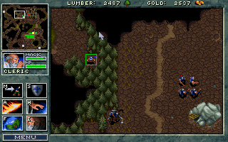
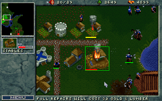

# WarCraft: Refurbished

Unofficial patch for the v1.21 MS-DOS version of the game WarCraft: Orcs & Humans by Blizzard Entertainment.

## Features

* Remove need of clicking to trigger map scrolling at the screen border.
* Change default left mouse button behaviour to drag select.
* Change grid display toggle hotkey from G to TAB.
* Remove center map on unit command from hotkey C.
* Remove mouse navigation command from hotkey N.
* Add rendering of hotkey information to action buttons.
* Change hotkey for cancelling construction from 0 to ESC.
* Change hotkey for cancelling training from 0 to ESC.
* Change hotkey for cancelling upgrades from 0 to ESC.
* Remove restriction of building next to cobbled road.
* Remove restriction of building near other buildings.
* Change the range of spearmen from 4 to 5.
* Change the damage of spearmen from 5 to 4.
* Change the name of the Orc "Temple" building to "Altar".
* Change action button hotkeys such that they better match their actions.
* Add rendering of health bars for damaged units.
* Change the damage of peasants from 0 to 2.
* Change the damage of peons from 0 to 2.
* Add contextual dispatch of commands to selected units through right mouse button.

## Installation

* Download the latest release package from https://github.com/joelek/wc-refurbished/tags and unpack it.
* Copy the executable `wcrpatch.exe` from the `dist` folder to the installation folder for WarCraft: Orcs & Humans version 1.21.
* Run the executable `wcrpatch.exe` in MS-DOS or DOSBox.
* Launch the game as normal through `WAR.EXE`.

## Development

The original executable is disassembled using [IDA - The Interactive Disassembler](https://en.wikipedia.org/wiki/Interactive_Disassembler). The disassembly is not bundled together with this project as it contains the original executable which is copyrighted by Blizzard Entertainment.

New code is written in assembler using the 80386 [IA-32](https://en.wikipedia.org/wiki/IA-32) instruction set and converted to binary patches using the [genpatch](./public/tools/genpatch.js) utility. The [wcrpatch](./source/wcrpatch.c) utility itself is written in [C99](https://en.wikipedia.org/wiki/C99) and compiled for the [MS-DOS](https://en.wikipedia.org/wiki/MS-DOS) target using the [Open Watcom C/C++](https://en.wikipedia.org/wiki/Watcom_C/C%2B%2B) compiler.

## Sponsorship

The continued development of this software depends on your sponsorship. Please consider sponsoring this project if you find that the software creates value for you and your organization.

The sponsor button can be used to view the different sponsoring options. Contributions of all sizes are welcome.

Thank you for your support!

### Ethereum

Ethereum contributions can be made to address `0xf1B63d95BEfEdAf70B3623B1A4Ba0D9CE7F2fE6D`.

## Roadmap

* Change mouse scroll speed such that it is reduced by a factor of two.
* Add center map on unit command to clicking unit portrait.
* Add rendering of food supply and demand to top bar.
* Add rendering of unit stats (hit points, range, armor, damage, piercing damage) when selecting a single unit to hotkey F9.
* Add unit grouping.
* Reduce border scroller region.
* Add hover tooltip.
* Clear worker carrying flags when issuing harvest command.
* Fix health bar position for daemon.
* Add return goods to town hall contextual command.
