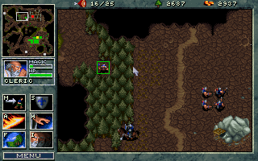
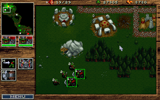

# WarCraft: Refurbished

Unofficial patch for the MS-DOS version of the game WarCraft: Orcs & Humans by Blizzard Entertainment.

## Features

### Next version

* Add patch customization options.

### v0.8.0

* Add support for game version 1.22h.

### v0.7.0

* Add hover tooltips for units and buildings.
    * Hover over a unit or building with the mouse to display its stats in the bottom status bar (when empty).
* Add new contextual dispatch of commands to selected units.
    * Dispatch `cast heal spell` commands by selecting a single cleric and right clicking a friendly unit.
* Add center map on selected unit command to SPACE.
* Change the fog of war reveal diameter for moving units from 5 to 7.
* Change the fog of war reveal diameter for far sight/dark vision spell from 5 to 7.

### v0.6.0

* Add rendering of food supply and demand to top bar.
* Change the main menu graphic.
* Add rendering of unit groups.
* Change keyboard and mouse scroll speed such that it matches the select location/target scroll speed.
* Change border scrolling region from 9 pixels to 1 pixel.

### v0.5.0

* Add unit grouping.
    * Create groups by selecting any units and pressing `0-9` while holding `left or right control`.
    * Recall groups by pressing `0-9`.
* Add new contextual dispatch of commands to selected units.
    * Dispatch `return goods to town hall` commands by selecting only workers carrying goods and right clicking the town hall.
* Improve contextual command dispatch logic.

### v0.4.0

* Add contextual dispatch of commands to selected units.
    * Dispatch `harvest lumber` commands by selecting only workers not carrying goods and right clicking forest tiles.
    * Dispatch `harvest gold` commands by selecting only workers not carrying goods and right clicking a gold mine.
    * Dispatch `repair` commands by selecting only workers and right clicking a damaged building.
    * Dispatch `attack` commands by selecting any units and right clicking an enemy unit.
    * Dispatch `move` commands by selecting any units and right clicking anywhere on the map.
* Change the damage of peasants from 0 to 2.
* Change the damage of peons from 0 to 2.

### v0.3.0

* Add rendering of health bars for damaged units.

### v0.2.0

* Change action button hotkeys such that they better match their actions.
* Change the name of the Orc "Temple" building to "Altar".

### v0.1.1

* Improve drag select logic.

### v0.1.0

* Change the damage of spearmen from 5 to 4.
* Change the range of spearmen from 4 to 5.
* Remove restriction of building near other buildings.
* Remove restriction of building next to cobbled road.
* Change hotkey for cancelling upgrades from 0 to ESC.
* Change hotkey for cancelling training from 0 to ESC.
* Change hotkey for cancelling construction from 0 to ESC.
* Add rendering of hotkey information to action buttons.
* Remove mouse navigation command from hotkey N.
* Remove center map on selected unit command from hotkey C.
* Change grid display toggle hotkey from G to TAB.
* Change default left mouse button behaviour to drag select.
* Remove need of clicking to trigger map scrolling at the screen border.

## Supported versions

* Retail MS-DOS version 1.21
* Retail MS-DOS version 1.22h

## Installation

* Download the latest release package from https://github.com/joelek/wc-refurbished/tags and unpack it.
* Copy the executable `wcrpatch.exe` from the `dist` folder to the installation folder for WarCraft: Orcs & Humans.
* Run the executable `wcrpatch.exe` in MS-DOS or DOSBox.
* Launch the game as normal through `WAR.EXE`.

## Development

The original executable is disassembled using [IDA - The Interactive Disassembler](https://en.wikipedia.org/wiki/Interactive_Disassembler). The disassembly is not bundled together with this project as it contains the original executable which is copyrighted by Blizzard Entertainment.

New code is written in assembler using the 80386 [IA-32](https://en.wikipedia.org/wiki/IA-32) instruction set and converted to binary patches using the [Keystone](https://www.keystone-engine.org/) assembler through the [compile](./public/tools/compile.js) utility. The [wcrpatch](./source/wcrpatch.c) utility itself is written in [C99](https://en.wikipedia.org/wiki/C99) and compiled for the [MS-DOS](https://en.wikipedia.org/wiki/MS-DOS) target using the [Open Watcom C/C++](https://en.wikipedia.org/wiki/Watcom_C/C%2B%2B) compiler.

### Docs

* [entities](./public/docs/entities.md)
* [executable v1.21](./public/docs/executable_v121.md)
* [executable v1.22h](./public/docs/executable_v122h.md)

## Sponsorship

The continued development of this software depends on your sponsorship. Please consider sponsoring this project if you find that the software creates value for you and your organization.

The sponsor button can be used to view the different sponsoring options. Contributions of all sizes are welcome.

Thank you for your support!

### Ethereum

Ethereum contributions can be made to address `0xf1B63d95BEfEdAf70B3623B1A4Ba0D9CE7F2fE6D`.

## Roadmap

## References

* https://stanislavs.org/helppc/int_21-25.html
* https://wiki.osdev.org/PS/2_Keyboard#Scan_Code_Sets
* https://open-watcom.github.io/open-watcom-1.9/pguide.html#DOSD4GW__Int31H_Function_Calls
* https://grandidierite.github.io/dos-interrupts/
* https://dosgraphicseditor.blogspot.com/p/mouse-events-tutorial.html
* https://en.wikipedia.org/wiki/INT_13H
* https://wiki.archlinux.org/title/Open_Watcom
